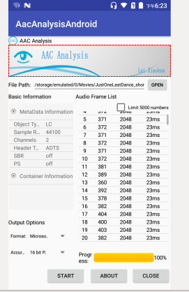
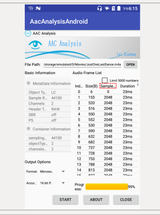

本项目是基于开源工程faad2在Android平台上开发的AAC分析器，可以简单分析本机上的AAC碼流文件

软件运行后，首先打开一个AAC文件（或者是M4A文件）。

注：AAC文件就是不经封装的音频流。M4A文件就是以MPEG-4标准的封装格式进行封装的AAC。

单击“开始”，软件就会开始解码AAC音频文件，右边显示了解码的进程以及音频帧信息，左边显示了解码过程中提取出来的一些信息。

在软件的左下角，可以设置输出音频原始采样数据的格式（PCM或者WAV）。

编译 
进入jni目录 
执行 ndk-build

运行 
直接用AS运行即可

点击打开按钮，在文件浏览器上选择要分析的aac碼流文件,选择的文件路径会在软件界面编辑框上显示出来，界面如下
;

点击打开按钮，在文件浏览器上选择要分析的mp4碼流文件,选择的文件路径会在软件界面编辑框上显示出来，界面如下
;

附加上aac碼流文件JustOneLastDance_short.aac和MP4文件JustOneLastDance.m4a，测试时将它拷贝到手机上即可

